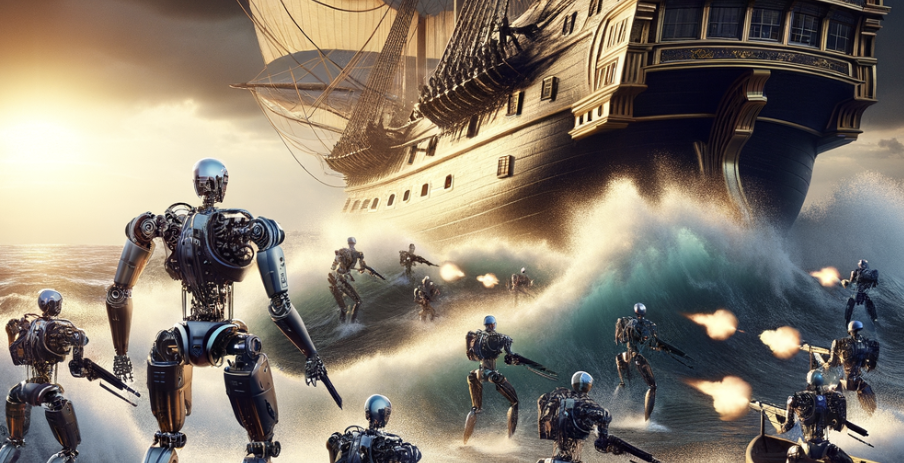

# Menu
1. [Game Preview](#Game-Preview)  
   I. [Game Trailer](#Game-Trailer)  
   II. [Storyline](#Storyline)  

2. [Game initialization](#Game-initialization)  
   I. [Control](#Control)  
   II. [Game Process](#Gaming-Process-(Rules))  

3. [Features implemented](#Features-implemented)  

4. [Group members](#Group-members)

# Game Preview
## Game Trailer 

************Video here*************

#### **Remember to enlarge your terminal window to full screen for better experience**

### Storyline
In the near future, the world teeters on the edge of a massive war. Resources are dwindling, and the stakes for global power have never been higher. In a bid to prevent catastrophic loss on both sides, the world's nations agree to an unprecedented challenge: a high-stakes game known as "RoboConflict: Global Showdown."

You are chosen to represent your country in this utlimate contest of strategy and skill. While the opponents are a series of advanced, AI-powered robots, each designed by a different nation, with some possessing higher levels of cunning and prevision than others.

Prepare your wits, strategize carefully, and remember: the future of your nation rests in your hands.

# Game initialization
 `make`
 
`./main`

**Be sure to wait for a moment before continuing to the next process**
That's ALL!
### Control 
- Use keypad to control your choice
- Use _Upper Arrow_ and _Lower Arrow_ to select in the menu
- Press _Enter_ to confirm selection
- Press _Ctrl + C_ if you wish to **leave** the game early!

### Gaming process (Rules)
You will have to do the following: 

- **Enter** the map size that you wish to play on
- Place your ships on ideal places by:
 - Choosing the **size of the ships** correspondingly
 - Placing the ships by entering the **x-coordinate (no. row) first**, **followed by the y-coordinate (no.column)**
 - The coordinate you entered will be the **_coordinate of the Top Left corner of the ship_**
- Enter the coordinate of the places that you wish to hit
- Take turns between the player and the robots to guess where the ships are

# Features implemented
- **Generation of random events**
   - The AI combating system uses psudo-probability to hit the player's ship
- **Data structure used**
   - For storing the game map, we defined a class (see map.h)
   - We used vector as the major STL container
   - We used list to contain the array of available ships' shape
- **"Intelectual AI"**
   - We grant robots intellegence by allow them to cheat - _Every 3 turns, they were about to directly locate one of the player's ship_
- **In-game decorations**
   - Short end game video generated using ASCII arts
   - Ships are made obvisous using text colours 
- **Users' selection**
   - Developped a user meun for mode choosing
   - User can generate corresponding map size based on their favour

# Group members
1. Ning Yi Fan
2. Zheng Han
3. Yin Jie 3036097243
4. Fong Shu Hung 3036073077
